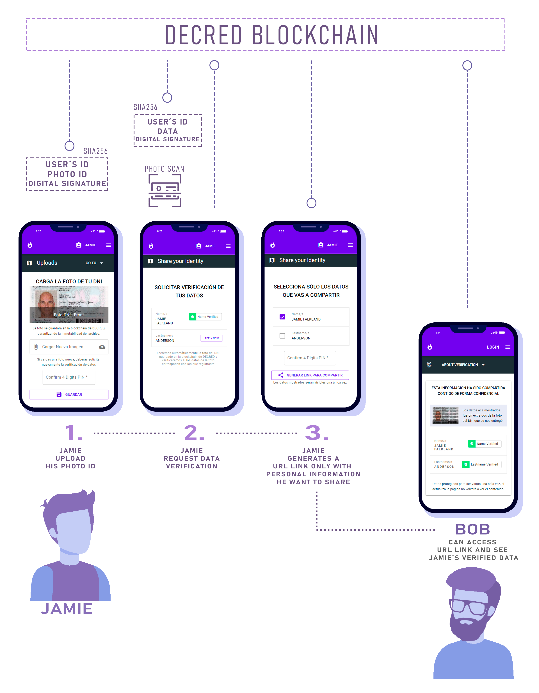

## OVERVIEW

This Project was developed for Blockchain Learning Challenge - Decred / Talent Land Latinoamérica, using Decred´s blockchain native data.

## ABOUT THIS PROJECT

This project was an original idea to solve a specific use case that is stopping the growth of P2P cryptocurrency trading. Especially in latin american countries.

### PROBLEM TO SOLVE:

Daily a thousands of cryptocurrency buyers, must submit and ID photo to verify their identities to a seller they dont know in person.
Give the ID photo to another person involves many risks, for example, identity theft, data leakage, privacy violation and more.
So, because of the refusal of the buyers to share the photo ID and the risk of losing sales,the sellers stop asking for it, thats
when the sellers start taking risks, for example unknowingly participating in money laundering, scams, triangulations scheme, hacking bank accounts and more.


### SOLUTION:
I created this project to solve this problem using Decred´s blockchain timestamp API
Release 1 - Github – For Challenge Decred
APIs: User´s registration, photo ID uploads, automatic data verification, views generator and verified data view.
This project, will migrate later to centralize database to a fully decentralize functionality. 

* 3 roles: 
- We, as a service provider.
- User who need to share data information or ID photo. We call it 'USER' for now on. 
- Cryptocurrency seller who needs to know the identity of 'USER'

#### STEP 0: 
"USER" must registry and create a Signature or 4 digits PIN.
This signature will be use for guarantee the consent for each action that the 'USER' decide to take. 
This signature is intended to be replaced for a private key in future versions.

#### STEP 1:
"USER" uploads his photo ID in our servers and sign this operation. 
We will create a unique registry in DECRED´s blockchain. 

#### STEP 2: 
"USER" send us a request telling what personal information we have to verify. for example, he choose "Name". 
So, we will validate the signature, and scan automaticly the photo ID image and obtain the 'Name'. The algorith compares the user´s name in databse and compare with photo ID. if matches, we timestamp the name in Decred´s blockchain and save it in database as verified name. 

#### STEP 3:
"USER" choose what verified personal information want to share with seller. 
We will verify the data in Decred´s blockchain and validate with user´s signature. all this process will generates an ID VIEW 

--- ID VIEW characteristics: 
Its a unique id with one time life. this id view will be use it in a API request, as URL query. After the first response, this idView will return no data.
Example GET call with query: `http://domain.com/identities?idView=ID-ONE-TIME-LIFE`


#### FINAL STEP: 
the seller can now access this link(URL) with idView and see the verified data that the buyer decided to share with him.
For security reasons, the data will be displayed only once.

--- The GET call to API returns for example:
``` 
{ usersName: 'John', lastname:'Doe' }
```

### IMPACT OF THE PROJECT ON THE CRYPTOCURRENCY COMMUNITY

Daily, thousands of latin american cryptocurrency traders facing the problem of this project is intended to solve. 
We trade bitcoin, and now, we can tell them about another crypto that can solve an identity problem. 
Decred´s blockchain definitly solve this specific problem. No matter if Localbitcoins or another exchange platform improve 
their KYC systems or identity systems, the latin american people still need another identity verification layer, especially
if it comes associated with something they already know, the inmutability of a blockchain network. Definitly its a great oportunity to
tell them about DECRED´s project. 


### INITIAL AND SPECIFIC OBJECTIVES OF THIS PROJECT

Understand technical issues of blockchain technology is not easy for anyone to starts in this blockchain world. So i decide start develop this project with basics concepts, for example databases instead of blockchain storage, signatures instead fo private keys, and more. After complete user interface the functionalities will migrate from centralized database and user registration to decentralized functionalities in Decred´s blockchain. Also buyer´s personal information will share encrypted with seller´s public key.

### DEMO FRONT END 
#### Backend Tasks
* User´s id ,Signature , Photo Id combined hash.
* Scan and read image to get names and lastname from a photo ID.
* Share verified data using an ID View.




### NEXT RELEASES

* Complete 100% user interface infrastructure
* Migrate from centralize to a fully decentralize functionalities.


## APIs

REST API, calls with HTTP protocol, 
* Important: use prefix  `/api` 


#### Endpoints

| Tipo |   Ruta              | Descripción                | Datos                                              |
| ---- |-------------------- | -------------------------- | -------------------------------------------------- |
| POST | `/users`            | user´s registry            | Ejm.Body: {name,lastname,email,password,signature} |
| POST | `/photos/:id`       | Upload Id Photo            | Ejm.Body: {dataType,data,signature}                |
| POST | `/verifications/:id`| user´s data verification   | Ejm.Body: {dataType,signature}                     |
| POST | `/shares/:id`       | Share verified data        | Ejm.Body: {signature,types}                        |
| GET  | `/identities`       | view of shared data        | Ejm.Query: ?viewId=UNICO-ID                        |
| GET  | `/`                 | Test only                  | response 'okay'                                    | 


### data types:
- name: String - Name/s as it appears in photo Id
- lastname: String - lastname/s as it appears in photo Id
- signature: String - PIN or digital signature
- email: String - optional not null
- password: String - optional not null
- dataType: String - for photo Id front use 'photoIdFrontBinary'
- data: Binary Base64 encoded - *see function number 1 
- types: Array of dataTypes - Example: types:['usersName', 'usersLastname']

```
FUNCTION 1

const getBinary = async (pathImage) => {
    const data = await fs.readFile(pathImage, "binary");
    return new Buffer.from(data, 'binary')
}
```

### Server Responses

| Status |   Type           | Description                | 
| ------ |----------------- | -------------------------- | 
| 200    | SUCCESS          |                            | 
| 400    | INVALID_ARGS     |  INVALID ARGUMENTS       | 
| 404    | NOT_FOUND        |  RESOURCE NOT FOUND     | 
| 500    | INTERNAL_ERROR   |  INTERNAL ERROR             | 
| 520    | SERVER ERROR     |  others                     | 


## Projects Tests - Mocha - Scripts
```
npm install
```
```
npm run tdd
```


## Configuration Project

* This project use MongoDB.
add a new one in: ` /src/dao/factory/daoFactory/ `
Consider for future releases: database will be fully replace for a decentralize functionality

* .env File:

```
TIMESTAMP_NETWORK = 'testnet' 
TIMESTAMP_VERSION_API = 'v1'
DAO_TYPE = 'mongodb'
CNX_STRING_MONGO = 'mongodb+srv://<user>:<password>@cluster0.jxcuw.mongodb.net/<databse>?retryWrites=true&w=majority'
```

#### DECRED TIMESTAMP APIs

### Timestamp network 
 *  'mainnet' or 'testnet' by default
### Timestamp version API 
 * 'v1' recommended - or 'v2'

### dcrtime and Decred TIMESTAMP API FREE Service for timestamp Files 
 https://timestamp.decred.org/

### Credits for npm Dependencies package.json

    "axios": "^0.21.0",
    "body-parser": "^1.19.0",
    "crypto-js": "^4.0.0",
    "dcrtimejs": "0.0.5",
    "dotenv": "^8.2.0",
    "express": "^4.17.1",
    "mocha": "^8.2.1",
    "mongodb": "^3.6.3",
    "mongoose": "^5.10.15",
    "nodemon": "^2.0.6",
    "tesseract.js": "^2.1.4"

### Credits for images
* Home Vector Design
<a href="https://stories.freepik.com/people">Illustration by Freepik Stories</a>
* Credits for Avatars Design
<a href='https://www.freepik.es/vectores/personas'>Vector de Personas creado por studiogstock - www.freepik.es</a>
* Mockup Mobile
<a href='https://www.freepik.es/vectores/tecnologia'>Vector de Tecnología creado por freepik - www.freepik.es</a>
* Glasses and beard for avatar
<a href='https://www.freepik.es/vectores/hombre'>Vector de Hombre creado por freepik - www.freepik.es</a>
* hello guy for video demo
<a href="https://stories.freepik.com/web">Illustration by Freepik Stories</a> 
* people for video demo
<a href="https://storyset.com/people">Illustration by Freepik Stories</a> 


### LICENSE 

This project is licensed under the ISC License. See the LICENSE file for details.

ISC License (ISC)
Copyright 2020 Eliseo Abel Carhuanca Vilchez

Permission to use, copy, modify, and/or distribute this software for any purpose with or without fee is hereby granted, provided that the above copyright notice and this permission notice appear in all copies.

THE SOFTWARE IS PROVIDED "AS IS" AND THE AUTHOR DISCLAIMS ALL WARRANTIES WITH REGARD TO THIS SOFTWARE INCLUDING ALL IMPLIED WARRANTIES OF MERCHANTABILITY AND FITNESS. IN NO EVENT SHALL THE AUTHOR BE LIABLE FOR ANY SPECIAL, DIRECT, INDIRECT, OR CONSEQUENTIAL DAMAGES OR ANY DAMAGES WHATSOEVER RESULTING FROM LOSS OF USE, DATA OR PROFITS, WHETHER IN AN ACTION OF CONTRACT, NEGLIGENCE OR OTHER TORTIOUS ACTION, ARISING OUT OF OR IN CONNECTION WITH THE USE OR PERFORMANCE OF THIS SOFTWARE.