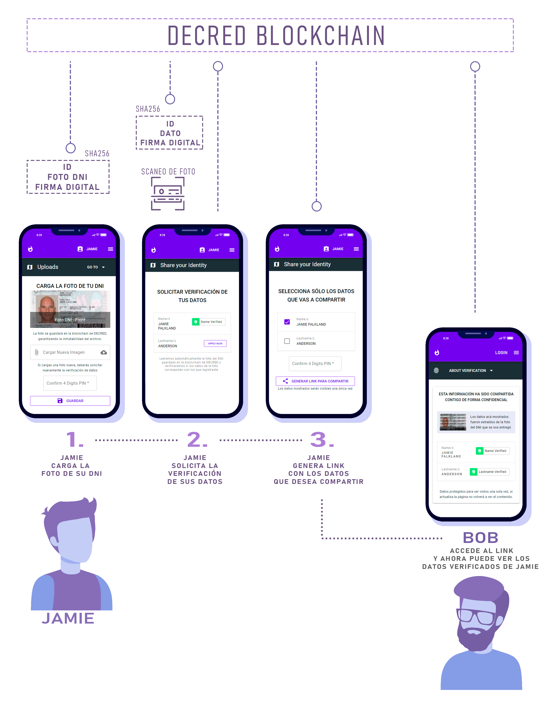

## README English Version
<a href="https://github.com/eliseoabelcarh/NodeJs-MongoDb-ChallengeAPI-DecredBlockchain/blob/master/README.en.md">Click here</a>


## OVERVIEW

Proyecto propio desarrollado para Blockchain Learning Challenge - Decred / Talent Land Latinoamérica,
 utilizando datos nativos de la blockchain de Decred


## ACERCA DE ESTE PROYECTO

Este proyecto es una idea original pensada para solucionar un caso de uso específico 
que viene obstaculizando el crecimiento del comercio de criptomonedas P2P.

### PROBLEMA A SOLUCIONAR:

A diario miles de compradores de criptomonedas deben enviar la foto del documento de identidad para poder
verificar su identidad a un vendedor que no conocen, esto implica un riesgo en la seguridad de los datos,
violación a la privacidad, posibles robos de identidad y más. En caso de negarse, la operación puede cancelarse, 
y según el vendedor podrían hasta recibir una calificación negativa en sus reputaciones.
Es así que a fin de no perder la venta, los vendedores también deciden no pedir identificación, lo que genera un nuevo riesgo para ellos, ya que si no 
identifican a sus compradores, podrían sin saberlo participar de lavado de activos, estafas, triangulaciones, hackeo
de cuentas bancarias y más.


### SOLUCIÓN:
El proyecto total consta de 2 partes, para :
* BACKEND - APIs Release 1 - Entregable para Challenge DECRED
* FRONTEND - Futuros releases - Desarrollo ya comenzado, screenshots reales más abajo.
https://github.com/eliseoabelcarh/vue-quasar-decred-blockchain-front-v1

* 3 roles: 
- Nosotros, como proveedores del servicio.
- El Usuario que necesita entregar la foto del DNI para identificarse, de ahora en adelante lo llamaremos "USUARIO".
- El vendedor de criptomonedas o empresa que necesita conocer los nombres reales de nuestro "USUARIO" (u otro dato que se implementará más adelante).

#### PASO 0: 
"USUARIO" se registra con nosotros, y crea un PIN.
Este PIN o Firma Digital será usado para garantizar el permiso por cada acción posterior que el "USUARIO" 
quiera realizar. Este PIN podrá ser reemplazado en futuros releases por una llave privada
y el uso de una wallet de criptomonedas.

#### PASO 1:
"USUARIO" carga la foto del DNI en nuestros servidores firmando el envío con su PIN creado.
Por nuestra parte, creamos un registro único e inmutable de esta foto en la blockchain de DECRED
utilizando las APIs de timestamp de DECRED, garantizando que no habrá alteración del archivo.

#### PASO 2: 
"USUARIO" solicita cuáles datos desea que nosotros verifiquemos. Por ejemplo elegiremos que sea el Nombre.
Al recibir la solicitud, validamos el PIN o firma y un algoritmo lee el nombre de la foto del DNI y lo compara
con el nombre registrado. En caso coincidan, toma el Nombre y lo registra como inalterable en la blockchain de DECRED.

#### PASO 3:
"USUARIO" elige qué datos de los verificados desea compartir, por ejemplo, asumamos que elige su NOMBRE y su APELLIDO.
El "USUARIO" firma la solicitud por cada dato, y por cada dato solicitado nosotros realizamos la verificación de su existencia en 
la blockchain de DECRED. Esto garantiza que los datos no han sido cambiados y que el consentimiento fue firmado por el "USUARIO".
Este proceso genera un ID VIEW. 

--- Características del ID VIEW: 
Es un id único e irrepetible de una sola vida, que será utilizado en una URL como llamada a nuestras APIs para obtener los datos que
"USUARIO" está compartiendo. Después de la primera llamada, el ID VIEW queda inválido y no devuelve datos.
Ejemplo de llamada GET con query: `http://dominio.com/identities?idView=ID-UNICO-E-IRREPETIBLE-DE-UNA-SOLA-VIDA`


#### PASO FINAL: 
El individuo o empresa que necesita verificar los nombres de nuestro "USUARIO", podrá visualizar los datos una sola vez, y
la autenticidad de los datos y el consentimiento del "USUARIO" serán garatizados por la inmutabilidad de la blockchain de DECRED. 

--- La llamada a la vista, mostrará como respuesta sólo los datos compartidos y verificados, por ejemplo:
``` 
{ usersName: 'Juan', lastname:'Pérez' }
```

### IMPACTO DEL PROYECTO EN LA COMUNIDAD CRIPTO

A diario miles de comerciantes de criptomonedas que realizan intercambios en distintas plataformas enfrentan el problema que este proyecto intenta solucionar. Proveer para ellos una opción de uso diario, en donde se pueda garantizar la identidad de una persona utlizando la red blockchain de DECRED, sería una razón importante para dejar de ver a las criptomonedas únicamente como un bien de valor intercambiable, en cambio, los que diariamente comercian con ellos, podrán apreciar el impacto real de
como un producto que comercializan impacta en ellos directamente y de otras formas diferentes a las habituales, lo que hará que conozcan de a pocos los aspectos técnicos que envuelven a esta tecnología y en especial poner foco a DECRED, quien es finalmente quien facilita esta solución.
 

### OBJETIVOS INICIALES Y ESPECÍFICOS DE ESTE PROYECTO

Entender la parte técnica de la tecnología Blockchain es uno de los retos más grandes para alguien que recién inicia en este rubro, ya sea programador o que no lo sea. Por lo tanto, mi primer objetivo fue desarrollar un proyecto que no esté completamente basado en blockchain, sino utilizar conceptos ya conocidos, por ejemplo, la de guardar información en una base de datos, utilizar un PIN como firma digital, etc, para posteriormente y progresivamente ir reemplazando estos conceptos y funcionalidades con tecnología blockchain. Por ejemplo, reemplazar el PIN o firma digital actualmente usado en el proyecto, por una clave privada. Asimismo, dejar de usar una base de datos centralizada y guardar la información encriptada y firmada con una clave privada, donde sólo la persona interesada pueda acceder a ellas y en caso quiera compartir datos, encriptar los datos con la llave pública de la otra persona. De esta forma será necesario que quien desea visualizar los datos que alguien le comparte, lo haga a través de una combinación entre el dato que desea leer y la llave privada que necesita para desencriptar esos datos. 

### EJEMPLO DEMO DE FRONT END PARA ESTE PROYECTO
#### Tareas que realizamos automáticamente en el Backend
* Hasheo de Id de usuario,Firma Digital y Foto para guardado de foto.
* Escaneo automático de foto y validación de datos en imagen. 
* Hasheo de Id de usuario,Dato Verificado y Firma Digital para guardar en blockchain.
* Entrega de datos verificados para ser visualizados una sola vez.




### PRÓXIMAS MEJORAS A ESTE PROYECTO

Continuar con el desarrollo de la interfaz de usuario y en un futuro migrar progresivamente las funcionalidades de lo centralizado a lo descentralizado por completo.


## APIs

Estas APIs son de tipo REST API, accesibles via protocolo HTTP, 
* IMPORTANTE: para todas las llamadas utilizar prefijo  `/api` 


#### Endpoints

| Tipo |   Ruta              | Descripción                | Datos                                              |
| ---- |-------------------- | -------------------------- | -------------------------------------------------- |
| POST | `/users`            | Alta de usuarios           | Ejm.Body: {name,lastname,email,password,signature} |
| POST | `/photos/:id`       | Cargar Foto DNI            | Ejm.Body: {dataType,data,signature} |
| POST | `/verifications/:id`| Verificación de Dato       | Ejm.Body: {dataType,signature}                     |
| POST | `/shares/:id`       | Datos a compartir          | Ejm.Body: {signature,types}                        |
| GET  | `/identities`       | Vista de datos compartidos | Ejm.Query: ?viewId=UNICO-ID                        |
| GET  | `/`                 | Test only                  | response 'okay'                                    | 


### Tipos de Dato:
- name: String - Nombre/s tal como aparece en foto DNI
- lastname: String - Apellido/s tal como aparece en foto DNI
- signature: String - PIN o firma digital
- email: String - opcional not null
- password: String - opcional not null
- dataType: String - para Foto DNI Frontal usar valor 'photoIdFrontBinary'
- data: Binary Base64 encoded - Ver función recomendada nro1 
- types: Array of dataTypes - Ejm: types:['usersName', 'usersLastname']

```
FUNCION NRO 1

const getBinary = async (pathImage) => {
    const data = await fs.readFile(pathImage, "binary");
    return new Buffer.from(data, 'binary')
}
```

### Server Responses

| Status |   Type           | Descripción                | 
| ------ |----------------- | -------------------------- | 
| 200    | SUCCESS          |                            | 
| 400    | INVALID_ARGS     |  Argumento Inválidos       | 
| 404    | NOT_FOUND        |  Recurso no Encontrado     | 
| 500    | INTERNAL_ERROR   |  Error Interno             | 
| 520    | SERVER ERROR     |  otros                     | 


## Tests para Proyecto
```
npm install
```
```
npm run tdd
```


## Configuration Project

* Este Proyecto utiliza MongoDB como persistencia.
Para agregar nuevo en: ` /src/dao/factory/daoFactory/ `
Considerar a Futuros releases:La base de datos centralizada será reemplazada totalmente por un sistema descentralizado.

* .env File:

```
TIMESTAMP_NETWORK = 'testnet' 
TIMESTAMP_VERSION_API = 'v1'
DAO_TYPE = 'mongodb'
CNX_STRING_MONGO = 'mongodb+srv://<user>:<password>@cluster0.jxcuw.mongodb.net/<databse>?retryWrites=true&w=majority'
```

#### DECRED TIMESTAMP APIs

### Timestamp network 
 *  'mainnet' or 'testnet' by default
### Timestamp version API 
 * 'v1' recommended - or 'v2'

### dcrtime and Decred TIMESTAMP API FREE Service for timestamp Files 
 https://timestamp.decred.org/

### Credits for npm Dependencies package.json

    "axios": "^0.21.0",
    "body-parser": "^1.19.0",
    "crypto-js": "^4.0.0",
    "dcrtimejs": "0.0.5",
    "dotenv": "^8.2.0",
    "express": "^4.17.1",
    "mocha": "^8.2.1",
    "mongodb": "^3.6.3",
    "mongoose": "^5.10.15",
    "nodemon": "^2.0.6",
    "tesseract.js": "^2.1.4"

### Credits for images
* Home Vector Design
<a href="https://stories.freepik.com/people">Illustration by Freepik Stories</a>
* Credits for Avatars Design
<a href='https://www.freepik.es/vectores/personas'>Vector de Personas creado por studiogstock - www.freepik.es</a>
* Mockup Mobile
<a href='https://www.freepik.es/vectores/tecnologia'>Vector de Tecnología creado por freepik - www.freepik.es</a>
* Glasses and beard for avatar
<a href='https://www.freepik.es/vectores/hombre'>Vector de Hombre creado por freepik - www.freepik.es</a>
* hello guy for video demo
<a href="https://stories.freepik.com/web">Illustration by Freepik Stories</a> 
* people for video demo
<a href="https://storyset.com/people">Illustration by Freepik Stories</a> 


### LICENSE 

This project is licensed under the ISC License. See the LICENSE file for details.

ISC License (ISC)
Copyright 2020 Eliseo Abel Carhuanca Vilchez

Permission to use, copy, modify, and/or distribute this software for any purpose with or without fee is hereby granted, provided that the above copyright notice and this permission notice appear in all copies.

THE SOFTWARE IS PROVIDED "AS IS" AND THE AUTHOR DISCLAIMS ALL WARRANTIES WITH REGARD TO THIS SOFTWARE INCLUDING ALL IMPLIED WARRANTIES OF MERCHANTABILITY AND FITNESS. IN NO EVENT SHALL THE AUTHOR BE LIABLE FOR ANY SPECIAL, DIRECT, INDIRECT, OR CONSEQUENTIAL DAMAGES OR ANY DAMAGES WHATSOEVER RESULTING FROM LOSS OF USE, DATA OR PROFITS, WHETHER IN AN ACTION OF CONTRACT, NEGLIGENCE OR OTHER TORTIOUS ACTION, ARISING OUT OF OR IN CONNECTION WITH THE USE OR PERFORMANCE OF THIS SOFTWARE.